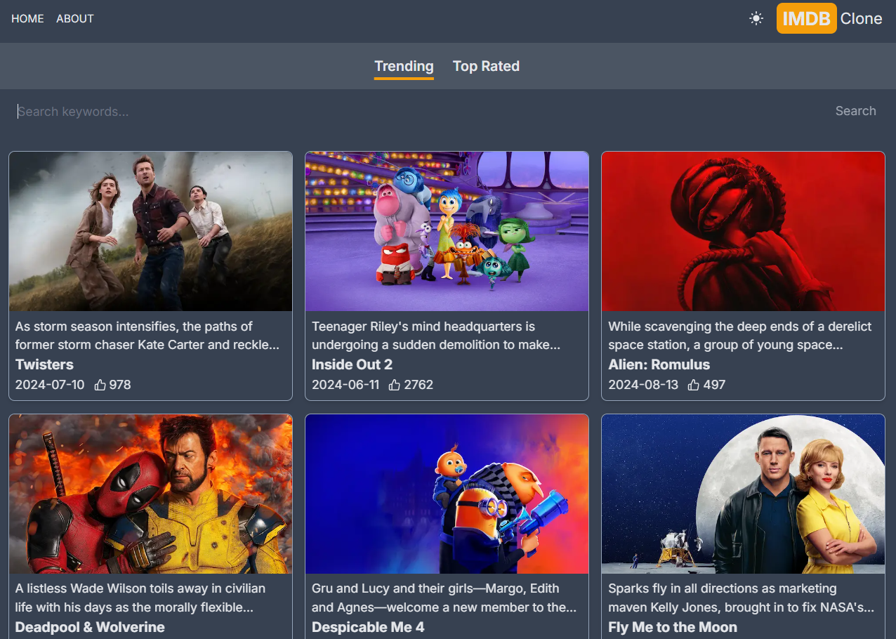

# IMDB Clone



An IMDB-style movie database website built with Next.js and Tailwind CSS.

[IMDB clone](https://linhung0319-imdb-clone.vercel.app/)

## Project Overview

This project is a clone of an IMDB-style movie database website, built using a modern web technology stack. It showcases my skills in front-end development, particularly with React, Next.js, and Tailwind CSS.

## Key Features

- Movie search functionality
- Responsive design
- Dark mode theme
- Movie detail pages

## Tech Stack

- Next.js
- React
- Tailwind CSS
- TMDB API

## Installation

1. Clone this repository

```
git clone https://github.com/linhung0319/imdb_clone
```

2. Install dependencies

```
npm install
```

3. Create a `.env.local` file and add your TMDB API key

```
API_KEY=your_api_key_here
```

4. Run the development server

```
npm run dev
```
